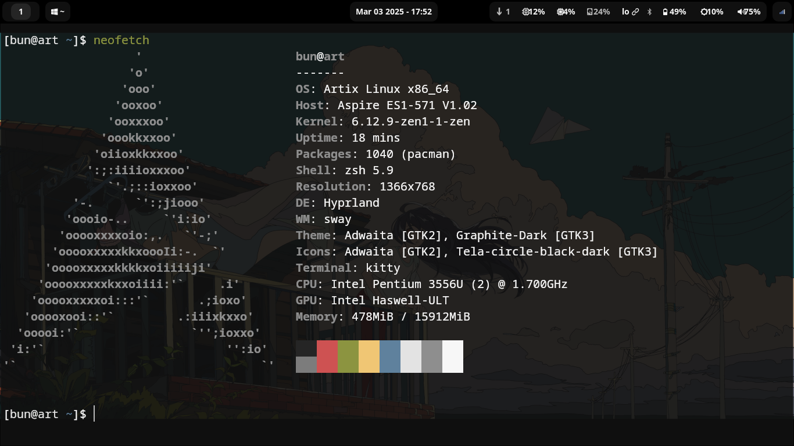

# Hyprland Config

This repository contains just the basics. For custom themes check out the
Themes section.

## Quickstart

```console
git clone https://github.com/alexjercan/hyprland.dotfiles.git
cd hyprland.dotfiles
./install
```


  ## Here are some ScreenShot 
  
  
  
  

